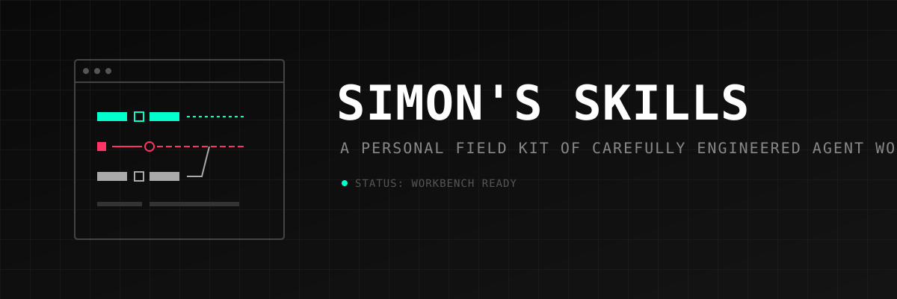

<div align="center">
  

  <br />
  <p><strong>A personal field kit of carefully engineered agent workflows.</strong></p>
</div>

---

## The Workbench

> **Status:** The workbench is ready. Original skills will appear here as they are completed and validated.

This repository is Simon's personal, curated collection of original AI-agent skills. It is currently in its foundational stage. The tools, validation scripts, and templates are established, but the skill catalog itself is intentionally empty pending the arrival of new, carefully engineered workflows.

## What is a Skill?

In this repository, a **skill** is defined as a reusable, documented agent workflow that provides significantly more value than a one-off prompt.

It is important to distinguish a skill from other constructs:
- **Prompt:** A static string of instructions. A skill contains prompts but structures them into a workflow with defined activation and completion boundaries.
- **Script:** A deterministic piece of code (like Python or Bash). Skills may *use* scripts, but skills themselves guide agent behavior and reasoning.
- **MCP Server:** A discrete tool providing external context or actions via the Model Context Protocol. Skills might depend on specific MCP servers to execute their workflows.
- **Application:** A full software system. A skill is a component—a behavior profile or operational manual applied to an agent within an existing environment.

A complete skill normally defines its activation conditions, target environments, prerequisites, workflow stages, safety boundaries, expected inputs, generated artifacts, and failure behavior.

## Supported Environments

Skills in this collection are designed to be adaptable but may explicitly target one or more of the following environments:
- Claude Code
- OpenAI Codex
- Grok
- Gemini CLI
- Jules
- Custom MCP-based agents
- Local coding agents

Each skill declares its supported targets in its `SKILL.md` frontmatter.

## Repository Principles

1. **Inspect before instructing:** Understand the context before taking action.
2. **Separate planning from implementation:** Establish a clear path before modifying state.
3. **Make permissions explicit:** Boundaries must be defined and respected.
4. **Never let an agent silently widen scope:** Stick to the defined objective.
5. **Preserve human approval at consequential boundaries:** High-risk actions require human oversight.
6. **Distinguish claims from verified evidence:** Back up capabilities with verifiable outputs.
7. **Define failure behavior:** Know what happens when things go wrong.
8. **Prefer reusable workflows over oversized prompts:** Modularity and clarity win over monolithic text.
9. **Keep model-specific assumptions visible:** If a skill requires a specific model's reasoning style, declare it.
10. **Optimize for operator control rather than maximum autonomy:** The human operator remains in the loop.

## Skill Catalog

The catalog is currently empty. Once skills are published, they will be listed here, linked to their respective directories in `skills/`.

## Installation and Usage

Do not clone this entire repository just to use a single skill.

To use a skill:
1. Navigate to its directory in the `skills/` folder.
2. Read the skill's `README.md` for specific usage and installation instructions.
3. Copy the `SKILL.md` or apply it to your agent environment according to the skill's specific target guidelines.

## Contributing a Skill

This is a personal repository, but contributions that align with the repository's principles and structure may be considered.

1. Read `CONTRIBUTING.md` and the `docs/authoring-guide.md`.
2. Generate a new skill using the provided template script: `python scripts/new_skill.py my-skill-slug`
3. Develop, document, and test the skill.
4. Validate the repository using `python scripts/validate_repository.py`.
5. Open a pull request.

## Repository Structure

```text
simons-skills/
├── README.md               # You are here
├── AGENTS.md               # Rules for AI agents operating in this repo
├── assets/                 # Repository-wide visual assets
├── docs/                   # Authoring and compatibility documentation
├── scripts/                # Utility and validation scripts
├── skills/                 # The skill catalog
└── templates/              # Reusable templates for new skills
```

## Validation

To ensure all skills meet the repository's metadata and structural requirements, run the validation script from the repository root:

```bash
python scripts/validate_repository.py
```

## License and Attribution

The original infrastructure, templates, and scripts in this repository are licensed under the MIT License (see `LICENSE`). Original skills added by Simon will generally adopt this license unless otherwise stated in their respective directories.

If a skill is adapted from or inspired by third-party work, attribution must be explicitly preserved in the skill's documentation and close to the derived work. Compatible licensing must be verified prior to inclusion. No third-party skill material is included in this repository.
